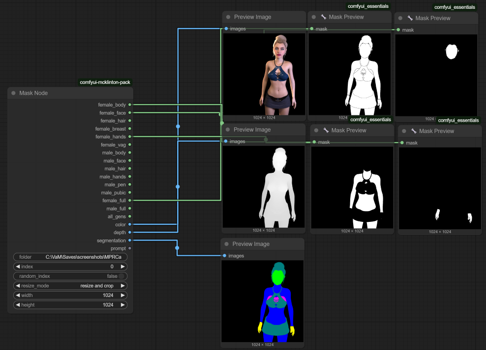

# ComfyUI McKlinton Pack — Mask Node

This custom node for ComfyUI enables detailed segmentation of colored mask images into specific anatomical regions for male and female bodies. 

 It is mainly intended to be used with Virt-A-Mate plugin SnapshotAnimator, which is able exporting depth, segmentation maps from VAM scenes. Plugin is available for my Patreons in https://www.patreon.com/McKlintonProductions. See also the plugin description in https://hub.virtamate.com/resources/snapshot-animator.45689/

## Features

- Reads pre-generated colored segmentation maps and extracts:
  - Female parts: body, face, hair, breasts, hands, genitals
  - Male parts: body, face, hair, hands, genitals, pubic area
- Generates combined masks for:
  - Entire male and female body masks
  - All genital regions
- Returns corresponding:
  - RGB color image
  - Depth map
  - Raw segmentation image
  - Prompt text associated with the image set
- Optional random sample selection from folder

## Folder Structure

This node expects a folder containing related image files, named in the following format:

    masks_<image_name>.png
    color_<image_name>.png
    depth_<image_name>.png
    prompt_<image_name>.txt

Each set of files must use the same <image_name> to be grouped together.

## How It Works

- It reads and processes one image set based on an index (or randomly).
- The mask image is processed by detecting exact RGB colors defined for each body part.
- Resulting masks are returned as tensors in the ComfyUI pipeline.

## Input Parameters

| Name           | Type     | Description                                             |
|----------------|----------|---------------------------------------------------------|
| folder         | string   | Path to folder containing the image sets                |
| index          | int      | Which image set to load (if random_index is false)      |
| random_index   | boolean  | If true, randomly selects one set from the folder       |

## Outputs

| Output Name      | Description                          |
|------------------|--------------------------------------|
| female_body      | Mask for female body (blue)          |
| female_face      | Mask for female face (green)         |
| female_hair      | Mask for female hair (teal)          |
| female_breast    | Mask for female breasts (magenta)    |
| female_hands     | Mask for female hands (yellow)       |
| female_vag       | Mask for female genitals (red)       |
| male_body        | Mask for male body (purple)          |
| male_face        | Mask for male face (pink)            |
| male_hair        | Mask for male hair (olive)           |
| male_hands       | Mask for male hands (orange)         |
| male_pen         | Mask for genitals (lime)             |
| male_pubic       | Mask for male pubic area (aqua)      |
| female_full      | Union of all female parts            |
| male_full        | Union of all male parts              |
| all_gens         | Union of genitals (vag, pen, pubic)  |
| color            | RGB color image (normalized tensor)  |
| depth            | Depth image (normalized tensor)      |
| segmentation     | Raw segmentation image               |
| prompt           | Prompt text (from .txt file)         |

## 🎨 Mask Identification Colors

| Mask    Name     | RGB Value        | HEX Code   |
|------------------|-------------------|------------|
| female_body      | (0, 0, 255)       | #0000FF    |
| female_face      | (0, 255, 0)       | #00FF00    |
| female_hair      | (0, 128, 128)     | #008080    |
| female_breast    | (255, 0, 255)     | #FF00FF    |
| female_hands     | (255, 255, 0)     | #FFFF00    |
| female_vag       | (255, 0, 0)       | #FF0000    |
| male_body        | (128, 0, 255)     | #8000FF    |
| male_face        | (255, 0, 128)     | #FF0080    |
| male_hair        | (128, 128, 0)     | #808000    |
| male_hands       | (255, 128, 0)     | #FF8000    |
| male_pen         | (128, 255, 0)     | #80FF00    |
| male_pubic       | (128, 255, 255)   | #80FFFF    |

## Installation

Clone this repository in directory:

    ComfyUI/custom_nodes/comfyui-mcklinton-pack

Then restart ComfyUI. The node will appear under:

    McKlinton/masking → Mask Node

## Notes

- Only exact RGB matches are used for mask generation.
- If a mask image is missing or can't be read, a zero-mask is returned instead.

## License

This project is under the Apache 2.0 License.
