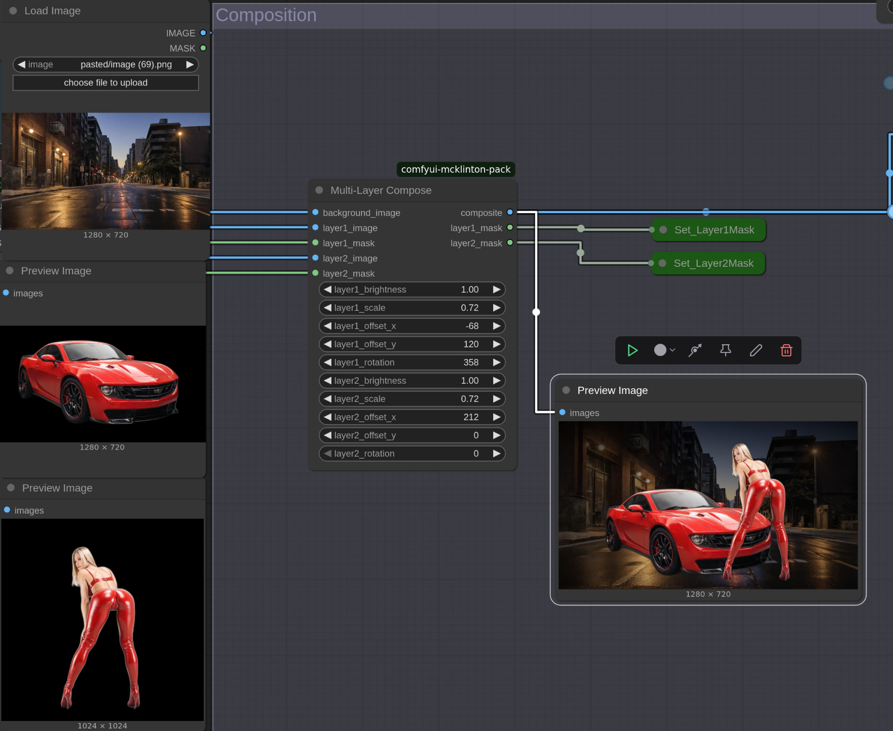

# MultiLayerComposeNode

**MultiLayerComposeNode** is a custom image compositing node designed for use in node-based visual processing pipelines. It enables users to overlay and manipulate two separate image layers onto a background, with independent control over transformation, brightness, and masking.

## Features

- Composites two image layers over a background image
- Supports per-layer:
  - Scaling
  - Position offset (X/Y)
  - Rotation
  - Brightness adjustment
  - Alpha masking
- Returns the final composite and the final masks for both layers

## Inputs

### Required Inputs

| Name               | Type   | Description |
|--------------------|--------|-------------|
| `background_image` | IMAGE  | The base image on which the layers will be composed |
| `layer1_image`     | IMAGE  | The first image layer |
| `layer1_mask`      | MASK   | Alpha mask for the first layer |
| `layer1_brightness`| FLOAT  | Brightness multiplier for layer 1 (0.0 - 2.0) |
| `layer1_scale`     | FLOAT  | Scale multiplier for layer 1 (0.0 - 5.0) |
| `layer1_offset_x`  | INT    | X-axis offset for layer 1 |
| `layer1_offset_y`  | INT    | Y-axis offset for layer 1 |
| `layer1_rotation`  | INT    | Rotation angle for layer 1 (degrees) |
| `layer2_image`     | IMAGE  | The second image layer |
| `layer2_mask`      | MASK   | Alpha mask for the second layer |
| `layer2_brightness`| FLOAT  | Brightness multiplier for layer 2 (0.0 - 2.0) |
| `layer2_scale`     | FLOAT  | Scale multiplier for layer 2 (0.0 - 5.0) |
| `layer2_offset_x`  | INT    | X-axis offset for layer 2 |
| `layer2_offset_y`  | INT    | Y-axis offset for layer 2 |
| `layer2_rotation`  | INT    | Rotation angle for layer 2 (degrees) |

## Outputs

| Output Name        | Type  | Description |
|--------------------|-------|-------------|
| `composite`        | IMAGE | The final composed image |
| `layer1_mask`      | MASK  | Final mask used for layer 1 |
| `layer2_mask`      | MASK  | Final mask used for layer 2 |

## Category

